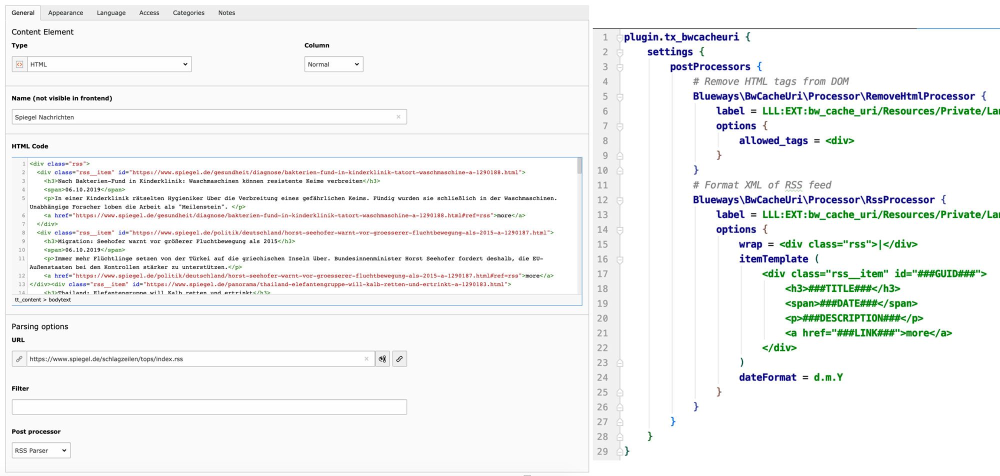

# DOM Downloader

This extensions extends the TYPO3 content element tt_content with CType 'html' for the functionality of loading remote content.



## Features

* Load and save remote content from URL
* Filter saved DOM with [CSS selectors](https://symfony.com/doc/current/components/css_selector.html)
* Manipulate the content with custom post-processors (e.g. stripe tags, add wrap,..)
* Options for processors via TypoScript
* Scheduler task to refresh content

## Install

See official [packages site](https://packagist.org/packages/blueways/bw-cache-uri) for requirements. You can use the [bitbucket issue tracker](https://bitbucket.org/blueways/bw_cache_uri/issues?status=new&status=open) to report errors or feature requests.

```
composer require blueways/bw-cache-uri
```

Activate the extension via Extension Manager and add the static TypoScript template

## Usage

Just create a new HTML-Content Element and add any URL in the parsing options.

## Scheduler

The DOM Downloader task will refresh the bodytext of all tt_content elements that have a parsing uri set.

## Post Processor

After receiving the remote content, custom post processors can be applied to transform the content, e.g. to wrap or remove text.
To register a new processor, add the following TypoScript:

```
plugin.tx_bwcacheuri.settings.postProcessors {
    Vendor\YourExt\Processor\MyFancyProcessor {
        label = Name in select box
        options {
            custom_setting = 2,4
            allowed_tags = <div>
        }
    }
}
``` 

Your processor class must implement the **PostProcessorInterface**:

```
<?php
namespace Vendor\YourExt\Processor;

class MyFancyProcessor implements \Blueways\BwCacheUri\Processor\PostProcessorInterface
{
    public function process($dom, $options)
    {
        return strip_tags($dom, $options['allowed_tags']);
    }
}
```


## DDEV cron job

See [ddev-contrib](https://github.com/drud/ddev-contrib/tree/master/recipes/cronjob) to see how to make the scheduler run locally.

